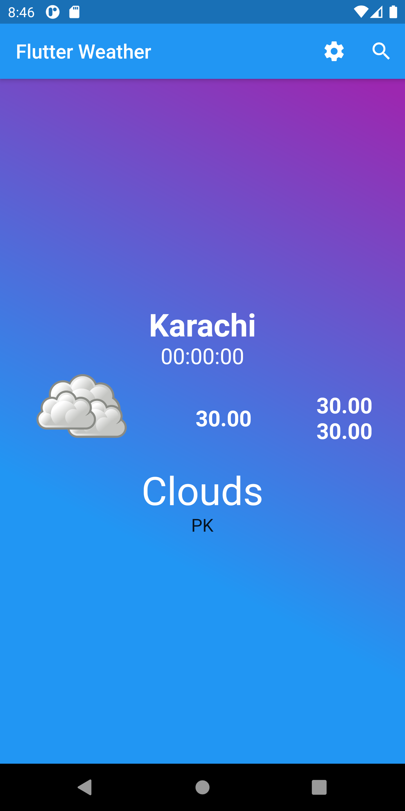
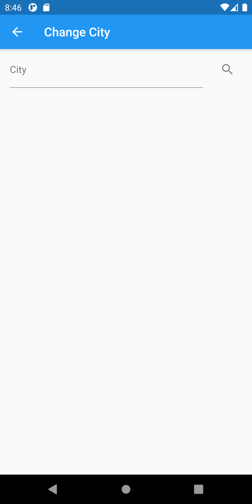
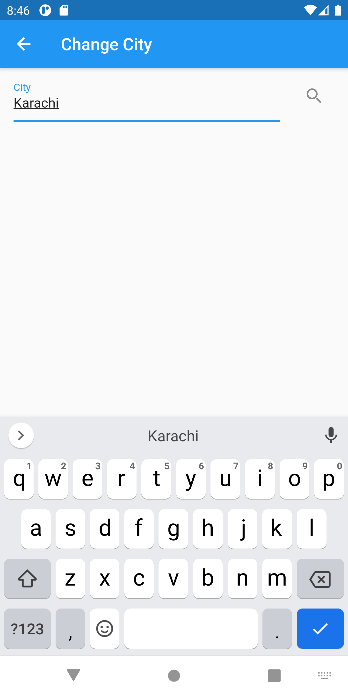
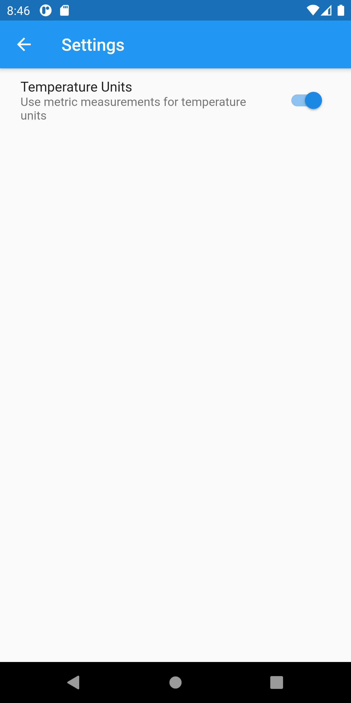

# VD_flutter_training_6

## Architecture

This app demonstrates usage of Bloc pattern for a previously developed weather application

# Screenshots

## Home Screen/Weather Panel

## Change City Screen

## Change City Screen with keyboard

## Settings
